  <picture>
    <source media="(prefers-color-scheme: dark)" srcset="./dark.svg">
    <source media="(prefers-color-scheme: light)" srcset="./light.svg">
    
  </picture>

### 👨‍💻 Languages, Frameworks and Libraries  

### 🐳 Containers & DevOps  

### 👨‍🔧 IDEs / Editors  

### 🔧 Version Control  

### 🐧 Operating Systems  

